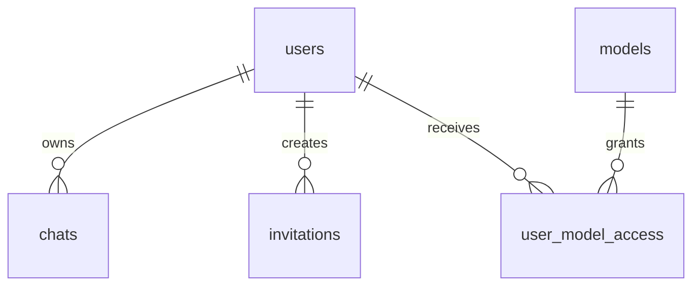

# Schema exacto propuesto para PocketBase

## Propósito

Definir el schema de PocketBase para reemplazar el backend actual basado en Supabase en `cloud mode`, preservando el contrato actual de la app y reduciendo duplicación estructural.

Este documento **no implementa** nada. Solo fija la forma objetivo de:

- colecciones
- campos
- relaciones
- reglas de acceso
- índices
- convenciones de datos

---

## Baseline y decisiones cerradas

### Baseline asumido
- `cloud mode` migra completamente a PocketBase
- `static mode` permanece intacto
- el frontend **mantiene** el contrato actual con `/api/*`
- fase 1 **mantiene adjuntos inline**
- PocketBase será la **fuente de verdad** de auth + datos cloud
- se acepta relogin al momento del corte

### Decisiones estructurales
1. **La colección `users` de PocketBase reemplaza la identidad y el perfil base de app.**
2. **El rol vive en `users.role` y no en una tabla paralela.**
3. **Los chats siguen guardando el payload completo en un campo JSON `data`.**
4. **`initialModelAccess` se mantiene como `json` en fase 1** para minimizar blast radius.
5. **`user_model_access` queda opcional**; en fase 1 no es necesario porque la lógica actual no hace ACL granular real por usuario más allá de admin vs enabled.

---

## Invariantes que el schema debe preservar

### Estado
- un usuario autenticado debe resolverse a un único `user.id`
- el rol efectivo debe poder leerse sin joins complejos
- cada chat cloud debe pertenecer a un único owner

### Feedback / observabilidad
- `/api/auth/me` debe poder devolver `id`, `email`, `role`
- el backend debe poder negar acceso a usuarios deshabilitados o inexistentes aunque el token siga siendo válido

### Blast radius
- no romper el shape actual de `ChatRecord`
- no exigir cambios masivos al frontend cloud

### Timing
- login debe producir un token usable inmediatamente contra `/api/*`
- aceptar invitación debe evitar carreras obvias con emails duplicados o invitaciones reutilizadas

---

# 1. Colecciones

## 1.1 `users`

### Tipo
`auth`

### Propósito
Reemplaza:
- Supabase Auth user
- `keryx_app_users`

### Campos custom

| Campo | Tipo PB | Required | Default | Notas |
|---|---|---:|---|---|
| `role` | `select` | sí | `user` | valores: `admin`, `user` |
| `enabled` | `bool` | sí | `true` | control operativo interno |
| `displayName` | `text` | no | - | opcional, no usado por la app hoy |

### Campos built-in de PB
- `id`
- `email`
- `password`
- `created`
- `updated`
- campos auth estándar de PocketBase

### Fuente de verdad
- identidad: `users.id`
- email: `users.email`
- rol: `users.role`
- estado habilitado: `users.enabled`

### Reglas sugeridas

#### List rule
Solo admins:
```text
@request.auth.id != "" && @request.auth.role = "admin"
```

#### View rule
El propio usuario o un admin:
```text
@request.auth.id != "" && (@request.auth.id = id || @request.auth.role = "admin")
```

#### Create rule
Cerrada para clientes. Creación desde backend/admin flow:
```text
false
```

#### Update rule
El propio usuario puede actualizar campos no sensibles a futuro; admin puede operar globalmente.

En fase 1, como la app no necesita self-service profile updates, conviene dejarla cerrada y operar desde backend:
```text
false
```

#### Delete rule
Solo backend/admin. Cerrar desde cliente:
```text
false
```

### Índices sugeridos
- único por email (PocketBase auth ya lo cubre normalmente)
- índice por `role`
- índice por `enabled`

### Observaciones
- `enabled` no reemplaza completamente una política de bloqueo, pero facilita revocar operativamente usuarios desde la app si luego se requiere.
- aunque el token sea válido, el backend debería volver a cargar el user y verificar `enabled`.

---

## 1.2 `chats`

### Tipo
`base`

### Propósito
Reemplaza `keryx_chats`.

### Campos

| Campo | Tipo PB | Required | Default | Notas |
|---|---|---:|---|---|
| `owner` | `relation -> users` | sí | - | single relation |
| `title` | `text` | no | - | nullable lógico |
| `visibility` | `select` | sí | `private` | valores: `public`, `private` |
| `data` | `json` | sí | - | guarda `ChatRecord` completo |
| `createdAtOriginal` | `text` o `date` | sí | - | conservar `chat.createdAt` del dominio |

### Recomendación de tipo para `createdAtOriginal`
Usar `text` con ISO string en fase 1.

#### Razón
El dominio ya trabaja con strings ISO y eso reduce adaptadores y parsing adicional.

### Campos built-in PB usados implícitamente
- `id`
- `created`
- `updated`

### Mapeo desde el schema actual
| Actual Supabase | Nuevo PocketBase |
|---|---|
| `id` | `id` |
| `owner_id` | `owner` |
| `title` | `title` |
| `visibility` | `visibility` |
| `created_at` | `createdAtOriginal` o `created` |
| `updated_at` | `updated` |
| `data` | `data` |

### Reglas sugeridas

#### List rule
Solo chats del owner:
```text
@request.auth.id != "" && owner = @request.auth.id
```

#### View rule
Solo owner:
```text
@request.auth.id != "" && owner = @request.auth.id
```

#### Create rule
Solo owner creando para sí mismo:
```text
@request.auth.id != "" && owner = @request.auth.id
```

#### Update rule
Solo owner:
```text
@request.auth.id != "" && owner = @request.auth.id
```

#### Delete rule
Solo owner:
```text
@request.auth.id != "" && owner = @request.auth.id
```

### Índices sugeridos
- índice por `owner`
- índice compuesto por `owner, created`
- índice compuesto por `owner, updated`
- opcional: índice por `visibility`

### Observaciones
- `favorites`, `votes`, `branches` y `messages` siguen incrustados dentro de `data`, igual que hoy.
- esto preserva el comportamiento actual y evita rediseñar el modelo de chats en esta migración.

---

## 1.3 `invitations`

### Tipo
`base`

### Propósito
Reemplaza `keryx_invitations`.

### Campos

| Campo | Tipo PB | Required | Default | Notas |
|---|---|---:|---|---|
| `email` | `email` | sí | - | guardar normalizado en minúsculas |
| `tokenHash` | `text` | sí | - | SHA-256 hex |
| `role` | `select` | sí | `user` | valores: `admin`, `user` |
| `expiresAt` | `text` o `date` | sí | - | fase 1: `text` ISO o `date`; ver nota abajo |
| `usedAt` | `text` o `date` | no | - | null = no usada |
| `createdBy` | `relation -> users` | sí | - | admin creador |
| `initialModelAccess` | `json` | sí | `[]` | string[] de model ids |

### Recomendación de tipos para fechas
Usar `text` ISO en fase 1 para `expiresAt` y `usedAt`.

#### Razón
La app actual ya opera enteramente con ISO strings y no hace consultas complejas por fecha desde DB. Esto reduce fricción y parsing.

### Reglas sugeridas

#### List rule
Solo admin:
```text
@request.auth.id != "" && @request.auth.role = "admin"
```

#### View rule
Solo admin:
```text
@request.auth.id != "" && @request.auth.role = "admin"
```

#### Create rule
Solo admin:
```text
@request.auth.id != "" && @request.auth.role = "admin"
```

#### Update rule
Solo admin:
```text
@request.auth.id != "" && @request.auth.role = "admin"
```

#### Delete rule
Solo admin:
```text
@request.auth.id != "" && @request.auth.role = "admin"
```

### Índices sugeridos
- único por `tokenHash`
- índice por `email`
- índice por `createdBy`
- índice por `usedAt`

### Observaciones
- la validación y aceptación pública de invitaciones **no debe** abrir reglas públicas en la colección.
- esos flujos deben seguir pasando por backend (`/api/invitations/validate`, `/api/invitations/accept`).

---

## 1.4 `models`

### Tipo
`base`

### Propósito
Reemplaza `keryx_models`.

### Campos

| Campo | Tipo PB | Required | Default | Notas |
|---|---|---:|---|---|
| `modelKey` | `text` | sí | - | equivalente a id lógico actual |
| `provider` | `select` | sí | - | `vercel`, `opencode` |
| `displayName` | `text` | sí | - | label visible |
| `supportsImages` | `bool` | sí | `false` | |
| `supportsSearch` | `bool` | sí | `false` | |
| `enabled` | `bool` | sí | `true` | |

### Identidad del registro
Hay dos opciones válidas:

#### Opción A — usar `modelKey` como campo único y dejar `id` autogenerado de PB
**Recomendada.**

#### Opción B — intentar preservar `id` igual al model id
No recomendada en fase 1, porque pelea con la convención natural de PB.

### Mapeo recomendado al dominio
- PB record `id`: interno PocketBase
- `modelKey`: valor que hoy la app llama `id`

Al salir hacia la app, el adaptador debe mapear:
- `id <- modelKey`

### Reglas sugeridas

#### List rule
Usuarios autenticados:
```text
@request.auth.id != ""
```

#### View rule
Usuarios autenticados:
```text
@request.auth.id != ""
```

#### Create rule
Solo admin/backend:
```text
@request.auth.id != "" && @request.auth.role = "admin"
```

#### Update rule
Solo admin/backend:
```text
@request.auth.id != "" && @request.auth.role = "admin"
```

#### Delete rule
Solo admin/backend:
```text
@request.auth.id != "" && @request.auth.role = "admin"
```

### Índices sugeridos
- único por `modelKey`
- índice por `provider`
- índice por `enabled`
- índice compuesto por `provider, displayName`

### Observaciones
- el sync del catálogo sigue viniendo del código (`VERCEL_MODELS`, `OPENCODE_MODELS`).
- la DB solo persiste flags operativos y materializa el catálogo administrable.

---

## 1.5 `user_model_access` (opcional)

### Tipo
`base`

### Estado
**No recomendada para fase 1**.

### Razón
La lógica actual en `getAllowedModelsForUser()` no usa ACL granular real:
- admin → ve todos los modelos
- user → ve solo `enabled = true`

Hoy existen funciones `getUserModelAccess()` y `setUserModelAccess()`, pero la política efectiva no las usa para decidir acceso final.

### Si se decide conservarla a futuro

| Campo | Tipo PB | Required | Default | Notas |
|---|---|---:|---|---|
| `user` | `relation -> users` | sí | - | |
| `model` | `relation -> models` | sí | - | |
| `createdAtOriginal` | `text` | sí | - | equivalente a `created_at` actual |

### Reglas sugeridas
Solo admin:
```text
@request.auth.id != "" && @request.auth.role = "admin"
```

### Índices sugeridos
- único compuesto `user, model`
- índice por `user`
- índice por `model`

### Recomendación
Aplazar esta colección hasta que exista una necesidad real de ACL granular por usuario/modelo.

---

# 2. Resumen de relaciones



### Relaciones efectivas de fase 1
- `users -> chats`
- `users -> invitations`
- `models` independiente
- `user_model_access` omitida salvo necesidad futura

---

# 3. Convenciones de serialización

## 3.1 Usuarios
### API app
Debe seguir devolviendo:
```ts
{
  id: string;
  email: string | null;
  role: "user" | "admin";
}
```

### Fuente de datos
- `id <- users.id`
- `email <- users.email`
- `role <- users.role`

---

## 3.2 Chats
### Campo `data`
Debe seguir guardando el `ChatRecord` completo:
```ts
interface ChatRecord {
  id: string;
  title: string | null;
  visibility: "public" | "private";
  createdAt: string;
  messages: any[];
  votes: any[];
  webSearch?: boolean;
  lastUsage?: LanguageModelUsage;
  branches?: Record<string, ChatBranchState>;
}
```

### Nota crítica
El record PocketBase tendrá su propio `id`, pero el dominio también ya usa `chat.id`.

#### Recomendación exacta
Usar el **mismo valor del dominio** como `record.id` si el cliente/server wrapper lo permite de forma segura; si no, añadir un campo único `chatId`.

### Decisión recomendada para fase 1
Agregar campo adicional:

| Campo | Tipo | Required | Notas |
|---|---|---:|---|
| `chatId` | `text` | sí | único, igual a `ChatRecord.id` |

#### Razón
Reduce fricción con PocketBase y evita depender de controlar el `id` interno del record.

### Ajuste al schema `chats`
El schema final recomendado de `chats` queda:

| Campo | Tipo PB | Required | Default | Notas |
|---|---|---:|---|---|
| `chatId` | `text` | sí | - | único |
| `owner` | `relation -> users` | sí | - | |
| `title` | `text` | no | - | |
| `visibility` | `select` | sí | `private` | |
| `data` | `json` | sí | - | |
| `createdAtOriginal` | `text` | sí | - | |

### Índice adicional obligatorio
- único por `chatId`

---

## 3.3 Models
El dominio actual espera:
```ts
{
  id: string;
  provider: string;
  displayName: string;
  supportsImages: boolean;
  supportsSearch: boolean;
}
```

### Adaptación
- `id <- modelKey`
- nunca exponer el `id` interno de PocketBase fuera del store

---

## 3.4 Invitations
### Token
- solo persistir `tokenHash`
- nunca guardar el token plano

### Email
- guardar siempre lowercase + trimmed

---

# 4. Reglas de backend vs reglas de PocketBase

## Principio
Las reglas de PocketBase deben dar una base de seguridad, pero **la app seguirá usando su backend `/api/*` como frontera principal**.

### Qué debe hacer PocketBase
- impedir acceso cruzado básico a registros
- impedir operaciones admin desde clientes no admin
- impedir lecturas directas no autorizadas si alguien intenta hablar con PB sin pasar por la app

### Qué debe seguir haciendo el backend
- `/api/auth/me`
- invitaciones públicas
- bootstrap admin
- validaciones de negocio
- control transaccional razonable
- sync del catálogo de modelos

---

# 5. Índices mínimos obligatorios

## `users`
- email único
- `role`
- `enabled`

## `chats`
- `chatId` único
- `owner`
- `(owner, created)`
- `(owner, updated)`

## `invitations`
- `tokenHash` único
- `email`
- `createdBy`
- `usedAt`

## `models`
- `modelKey` único
- `provider`
- `enabled`

## `user_model_access` si existe
- `(user, model)` único

---

# 6. Variables de entorno asociadas al schema

## Cliente
- `VITE_POCKETBASE_URL`

## Servidor
- `POCKETBASE_URL`
- `POCKETBASE_ADMIN_EMAIL`
- `POCKETBASE_ADMIN_PASSWORD`
- `BOOTSTRAP_ADMIN_EMAIL`
- `BOOTSTRAP_ADMIN_PASSWORD`

## Opcionales
- `POCKETBASE_PUBLIC_URL`
- `POCKETBASE_SUPERUSER_EMAIL`
- `POCKETBASE_SUPERUSER_PASSWORD`

### Nota
El nombre final de las credenciales admin debe decidirse de forma consistente en el plan técnico. Lo importante es separar:
- admin interno de PocketBase para operaciones server-side
- admin bootstrap de la app Keryx

---

# 7. Seed inicial recomendado

## `models`
Al iniciar por primera vez, poblar desde:
- `VERCEL_MODELS`
- `OPENCODE_MODELS`

### Política
- si no existe `modelKey`, crear
- si existe y cambió metadata (`provider`, `displayName`, `supportsImages`, `supportsSearch`), actualizar
- preservar `enabled`

## `users`
No sembrar usuarios salvo bootstrap admin explícito.

## `invitations`
Sin seed.

## `chats`
Sin seed.

---

# 8. Compatibilidad con el dominio actual

## Compatibilidad directa
- `AuthSession`
- `AuthUser`
- `ChatRecord`
- `AllowedModel`
- `AppInvitationRecord`

## Adaptación requerida
### Usuarios
`AppUserRecord` dejará de corresponder a una tabla separada y pasará a mapear `users`.

### Chats
`cloudStore` deberá buscar por `chatId`, no por el `id` interno de PB.

### Modelos
`appStore` deberá exponer `modelKey` como `id` del dominio.

---

# 9. Riesgos de schema y mitigaciones

## Riesgo 1 — mezclar `id` interno PB con `id` del dominio
### Mitigación
Usar `chatId` y `modelKey` como claves lógicas del dominio.

## Riesgo 2 — abrir reglas de invitaciones públicamente
### Mitigación
Mantener validate/accept solo vía backend.

## Riesgo 3 — depender de un ACL granular que hoy no existe realmente
### Mitigación
No crear `user_model_access` en fase 1 salvo necesidad comprobada.

## Riesgo 4 — usar tipos de fecha que compliquen la compatibilidad
### Mitigación
Fase 1 con ISO strings en campos app-managed.

---

# 10. Schema final recomendado para fase 1

## Colecciones obligatorias
- `users` (`auth`)
- `chats` (`base`)
- `invitations` (`base`)
- `models` (`base`)

## Colecciones no incluidas en fase 1
- `user_model_access`

## Campos clave por colección

### `users`
- `role`
- `enabled`
- `displayName`

### `chats`
- `chatId`
- `owner`
- `title`
- `visibility`
- `data`
- `createdAtOriginal`

### `invitations`
- `email`
- `tokenHash`
- `role`
- `expiresAt`
- `usedAt`
- `createdBy`
- `initialModelAccess`

### `models`
- `modelKey`
- `provider`
- `displayName`
- `supportsImages`
- `supportsSearch`
- `enabled`

---

# 11. Decisiones abiertas mínimas

Estas no bloquean el diseño, pero deben cerrarse antes de implementar:

1. **Nombre final de variables admin de PocketBase**
2. **Si `enabled` en users se usará desde el día 1** o solo se define para futuro
3. **Si `expiresAt` y `usedAt` serán `text` o `date`**
   - recomendación actual: `text` en fase 1
4. **Si `chatId` y `modelKey` serán únicos por índice o si se controlará además desde código**
   - recomendación: ambos, índice + validación

---

# 12. Recomendación final

El schema más coherente y de menor riesgo para esta migración es:

- consolidar usuario y rol en `users`
- persistir chats completos como JSON en `chats.data`
- usar `chatId` y `modelKey` como claves lógicas del dominio
- mantener invitaciones en backend con tokens hasheados
- aplazar ACL granular por usuario/modelo hasta que exista una necesidad real

Ese diseño reduce deuda, minimiza cambios de frontend y encaja bien con la topología actual de Keryx.
